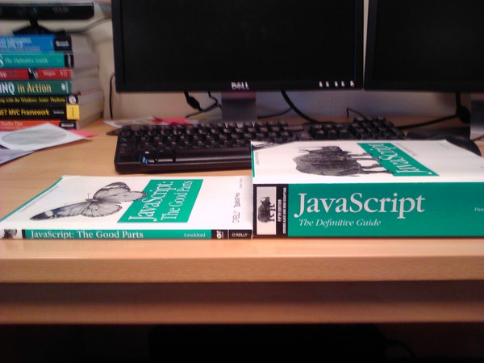

title: Ferris Capstone Talk  
author:  
 name: Mike Ward  
 twitter: mikeward_aa  
 url: http://mike-ward.net/talk-ferris-capstone  
 email: mike@mike-ward.net  
output: index.html  
style: style.css

--

# Ferris Capstone Talk
## Ramblings of an old fart programmer

<!-- MDE -->

--

### Who are You?


--

### Who am I?


--

### Many Colleagues don't have CS Degrees


--

### Iris Classon

-   as a licensed and registered clinical dietician she decided in 2011
    that she wanted to learn programming and rapidly went from 0 to 100.
    Within her first year, she earned MCSD, MCPD and MCTS certifications
    and was invited to join MEET – Microsoft Extended Experts Team

-   landed a fulltime developer job after just six months and a position
    as a Technical Evangelist for the renowned international company
    Telerik

-   Earned a Microsoft MVP award for her contribution to the dev
    community

--

<h1>Famous People</h1>
<h2>“If I have seen further it is by standing on the sholders \[sic\] of Giants” ― Issac Newton</h2>
----------------------------------------------------------------------------------------------------

### ???


--

### Grace Hopper

-   When she recommended that a new programming language be developed
    using entirely English words, she "was told very quickly that
    \[she\] couldn't do this because computers didn't understand
    English."

-   In 1952 invented the first compiler

-   Known as the A compiler and its first version was A-0

-   Other languages she invented included MATH-MATIC and FLOW-MATIC

--

### COBOL

-   In 1959 developed COBOL, a derivative of FLOW-MATIC

-   Hopper's belief was that programs should be written in a language
    that was close to English (rather than in machine code or in
    languages close to machine code, such as assembly languages)

-   COBOL went on to be the most ubiquitous business language to date

--

### First Bug


--

### ???


--

### John von Neumann

-   Described a computer architecture in which the data and the program
    are both stored in the computer's memory in the same address space.


--

### ???


--

### Claude Shannon

-   Invented the digital circuit as his Master's Thesis

-   Howard Gardner called Shannon's thesis "possibly the most important,
    and also the most noted, master's thesis of the century."

-   Invented Information Theory (bits and bytes)

--

<h1>Useful Stuff Lasts a Long Time</h1>
<h2>or why writing software is like sex</h2>
--------------------------------------------

#### One mistake and you end up supporting it the rest of your life

--

### Jacquard Loom


--

### Jacquard Loom

-   used replaceable punched cards to control a sequence of operations.

-   It is considered an important step in the history of computing
    hardware.

-   The ability to change the pattern of the loom's weave by simply
    changing cards was an important conceptual precursor to the
    development of computer programming and data entry. --

--

### Herman Hollerith

Inventor who developed an electromechanical punched card tabulator to
assist in summarizing information and, later, accounting.


--

### Null Reference

C.A.R. Hoare invented the null reference in 1965 as part of the Algol W
language.

> I call it my billion-dollar mistake. It was the invention of the null
> reference in 1965. At that time, I was designing the first
> comprehensive type system for references in an object oriented
> language (ALGOL W). My goal was to ensure that all use of references
> should be absolutely safe, with checking performed automatically by
> the compiler. But I couldn't resist the temptation to put in a null
> reference, simply because it was so easy to implement. This has led to
> innumerable errors, vulnerabilities, and system crashes, which have
> probably caused a billion dollars of pain and damage in the last forty
> years.

--

### Standards


--

<h1>Functional Programming</h1>
<h2>“Computer programs are the most complex things that humans make.” 
― Douglas Crockford, JavaScript: The Good Parts</h2>

------------------------------------------------------------------------

### Origins Functional Programming

-   John McCarthy invented Lisp in the late 1950s

-   Around 1959, he invented so-called "garbage collection" methods to
    solve problems in Lisp.

-   Lisp is the second-oldest high-level programming language in
    widespread use today. Only Fortran is older, by one year.

-   Lisp pioneered many ideas in computer science, including tree data
    structures, automatic storage management, dynamic typing,
    conditionals, higher-order functions and recursion.

--

### First Class Functions

Generally speaking, functional languages have first-class functions

-   Supports passing functions as arguments to other functions

-   Returning functions as the values from other functions

-   Assigning functions to variables or storing them in data structures

#### What's the world's most popular functional language?

--

### JavaScript

``` javascript
var x2 = x => x * 2;
var x2e = x => x2(x2(x));
console.log(x2e(2)); // => 8

var Y = function (h) {
    return (function (f) {
        return f(f);
    })(function (f) {
        return h(function (n) {
            return f(f)(n);
        });
    });
};

var fact = Y(function (g) {
    return function (n) {
        if (n < 2) return 1;
        return n * g(n - 1);
    };
});

fact(7) // => 5040
```

--

### JavaScript, The Good Parts



--

### Douglas Crockford

-   JavaScript is the only language that I'm aware of that people feel
    they don't need to learn before they start using it.

-   JavaScript is a language with more than its share of bad parts

-   Most programming languages contain good parts and bad parts. I
    discovered that I could be better programmer by using only the good
    parts and avoiding the bad parts.

--

<h1>Career</h1>
<h2>“Programmers are as emotional and irrational as normal people” - Douglas Crockford</h2>
-------------------------------------------------------------------------------------------

